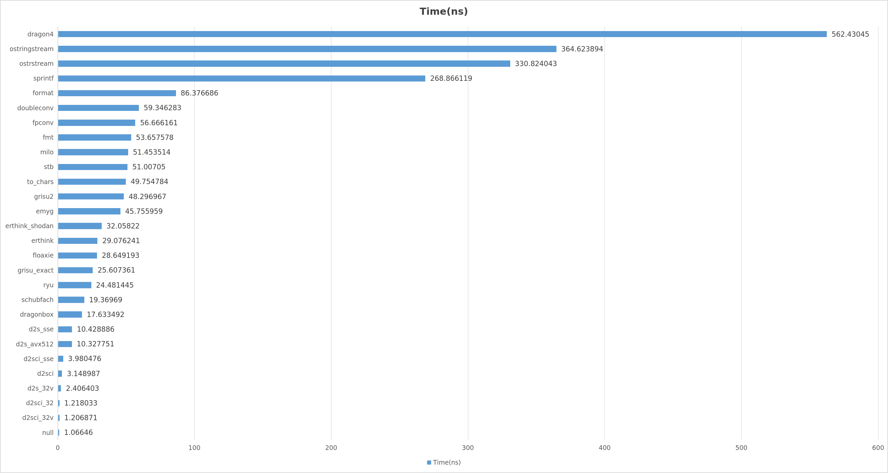

<!-- Required extensions: pymdownx.betterem, pymdownx.tilde, pymdownx.emoji, pymdownx.tasklist, pymdownx.superfences -->

# dtoa Benchmark

Copyright(c) 2019-2020 Leonid Yuriev <leo@yuriev.ru>,
Copyright(c) 2014 Milo Yip <miloyip@gmail.com>
Author's e-mail address : 1302035400@qq.com

## Preamble

This fork of the benchmark was created to demonstrate the performance superiority of my new `dtoa()` implementation over others.

All the source code can be found in the **src/d2sci** directory.

Because the number of double values is too large to be fully tested, there may be bugs. If there is any problem with the running results, please give feedback.
There may be clerical errors in the relevant notes, please understand.

## Introduction

This benchmark evaluates the performance of conversion from double precision IEEE-754 floating point (`double`) to ASCII string. The function prototype is:

~~~~~~~~cpp
void dtoa(double value, char* buffer);
~~~~~~~~

The character string result **must** be convertible to the original value **exactly** via some correct implementation of `strtod()`, i.e. roundtrip convertible.

Note that `dtoa()` is *not* a standard function in C and C++.

All new APIs are as follows:
~~~~~~~~cpp
extern "C"
{
    int d2sci_sse(double value, char *buffer);// print 1 double to 1 buffer ; digit 17;sse instruction
    int d2sci(double value,char* buffer);// print 1 double to 1 buffer ; digit 17;avx512 instruction
    int d2sci_32(double* value,char* buffer);// print 32 double to 1 buffer ; digit 17 ; avx512 instruction
    int d2sci_32_init();// 
    void d2sci_32v(double* value,char** buffer);// print 32 double to 32 buffer ; digit 17 ; avx512 instruction
    void d2s_32v(double* value,char** buffer);// print 32 double to 32 buffer ; shortest significant result;avx512 instruction
    int d2s_avx512(double value, char *buffer);//print 1 double to 1 buffer ; shortest significant result;avx512 instruction
    int d2s_sse(double value, char *buffer);//print 1 double to 1 buffer ; shortest significant result;sse instruction
}
~~~~~~~~

## API Introduction
Some API need CPU support AVX512 instruction set.

1. Print 1 double values to 1 buffers.
   The print result of double value contains 17 digits.
   return write buffer length;
   These two functions have the same output.
~~~~~~~~cpp
int d2sci(double value, char* buffer);//need avx512 instruction set
int d2sci_sse(double value, char *buffer);//need sse instruction set
~~~~~~~~
~~~~~~~~cpp
//example
double v=1.3;
char buf[32];
int len = d2sci(v,buf);
//int len = d2sci_sse(v,buf);
printf("len=%d,%s",len,buf);//len=22,1.3000000000000000e+00
//special value: when v is 1e-323 print 0.9881312916824931e-323
~~~~~~~~
1. Continuously print 32 double values to the buffer.
The print result of each double value contains 17 digits.
return write buffer length;
~~~~~~~~cpp
int d2sci_32(double* value, char* buffer);
~~~~~~~~
~~~~~~~~cpp
//example
    double v32[32];
    for(int i=0;i<32;++i) v32[i] = (i+1)*sin(1);
    char buffer_1024[1024];
    int len = d2sci_32(v32,buffer_1024);
    printf("len=%d\n%s",len,buffer_1024);
//print result
len=768
8.4147098480789650e-01 
1.6829419696157930e+00 
2.5244129544236892e+00 
3.3658839392315860e+00 
4.2073549240394827e+00 
5.0488259088473785e+00 
5.8902968936552753e+00 
6.7317678784631720e+00 
7.5732388632710687e+00 
8.4147098480789654e+00 
9.2561808328868622e+00 
1.0097651817694757e+01 
1.0939122802502654e+01 
1.1780593787310551e+01 
1.2622064772118447e+01 
1.3463535756926344e+01 
1.4305006741734241e+01 
1.5146477726542138e+01 
1.5987948711350034e+01 
1.6829419696157930e+01 
1.7670890680965825e+01 
1.8512361665773724e+01 
1.9353832650581619e+01 
2.0195303635389514e+01 
2.1036774620197412e+01 
2.1878245605005307e+01 
2.2719716589813206e+01 
2.3561187574621101e+01 
2.4402658559428999e+01 
2.5244129544236894e+01 
2.6085600529044793e+01 
2.6927071513852688e+01
//Nan or inf will not be printed when the input value is nan or inf.
~~~~~~~~

3. Print 32 double values to 32 buffers.
The print result of each double value contains 17 digits.
~~~~~~~~cpp
void d2sci_32v(double* value, char** buffer);
~~~~~~~~
~~~~~~~~cpp
//example
    double v32[32];
    for(int i=0;i<32;++i) v32[i] = (i+1)*sin(1);
    char buffer_1024[1024];
    char* buf_32[32];
    for(int i=0;i<32;++i) buf_32[i]=&buffer_1024[i*32];
    d2sci_32v(v32,buf_32);
    for(int i=0;i<32;++i) printf("i=%d,%.16le %s\n",i,v32[i],buf_32[i]);
//print result 
i= 0,8.4147098480789650e-01 8.4147098480789650e-01
i= 1,1.6829419696157930e+00 1.6829419696157930e+00
i= 2,2.5244129544236893e+00 2.5244129544236893e+00
i= 3,3.3658839392315860e+00 3.3658839392315860e+00
i= 4,4.2073549240394827e+00 4.2073549240394827e+00
i= 5,5.0488259088473786e+00 5.0488259088473786e+00
i= 6,5.8902968936552753e+00 5.8902968936552753e+00
i= 7,6.7317678784631720e+00 6.7317678784631720e+00
i= 8,7.5732388632710688e+00 7.5732388632710688e+00
i= 9,8.4147098480789655e+00 8.4147098480789655e+00
i=10,9.2561808328868622e+00 9.2561808328868622e+00
i=11,1.0097651817694757e+01 1.0097651817694757e+01
i=12,1.0939122802502654e+01 1.0939122802502654e+01
i=13,1.1780593787310551e+01 1.1780593787310551e+01
i=14,1.2622064772118447e+01 1.2622064772118447e+01
i=15,1.3463535756926344e+01 1.3463535756926344e+01
i=16,1.4305006741734241e+01 1.4305006741734241e+01
i=17,1.5146477726542138e+01 1.5146477726542138e+01
i=18,1.5987948711350034e+01 1.5987948711350034e+01
i=19,1.6829419696157931e+01 1.6829419696157931e+01
i=20,1.7670890680965826e+01 1.7670890680965826e+01
i=21,1.8512361665773724e+01 1.8512361665773724e+01
i=22,1.9353832650581619e+01 1.9353832650581619e+01
i=23,2.0195303635389514e+01 2.0195303635389514e+01
i=24,2.1036774620197413e+01 2.1036774620197413e+01
i=25,2.1878245605005308e+01 2.1878245605005308e+01
i=26,2.2719716589813206e+01 2.2719716589813206e+01
i=27,2.3561187574621101e+01 2.3561187574621101e+01
i=28,2.4402658559429000e+01 2.4402658559429000e+01
i=29,2.5244129544236895e+01 2.5244129544236895e+01
i=30,2.6085600529044793e+01 2.6085600529044793e+01
i=31,2.6927071513852688e+01 2.6927071513852688e+01
//Nan or inf will not be printed when the input value is nan or inf.
~~~~~~~~
4. Print 32 double values to 32 buffers.
this API base on Schubfach Algorithm;AVX-512 implementation.
The print result of each double value contains the shortest significant digit.
~~~~~~~~cpp
void d2s_32v(double* value, char** buffer);
~~~~~~~~
~~~~~~~~cpp
//example
    double v32[32];
    for(int i=0;i<32;++i) v32[i] = (i+1)*sin(1);
    char buffer_1024[1024];
    char* buf_32[32];
    for(int i=0;i<32;++i) buf_32[i]=&buffer_1024[i*32];
    d2s_32v(v32,buf_32);
    for(int i=0;i<32;++i) printf("i=%2d,%.17lg %s\n",i,v32[i],buf_32[i]);
//print result
i= 0,0.8414709848078965 8.414709848078965e-01
i= 1,1.682941969615793 1.682941969615793e+00
i= 2,2.5244129544236893 2.5244129544236893e+00
i= 3,3.365883939231586 3.365883939231586e+00
i= 4,4.2073549240394827 4.207354924039483e+00
i= 5,5.0488259088473786 5.048825908847379e+00
i= 6,5.8902968936552753 5.890296893655275e+00
i= 7,6.731767878463172 6.731767878463172e+00
i= 8,7.5732388632710688 7.573238863271069e+00
i= 9,8.4147098480789655 8.414709848078965e+00
i=10,9.2561808328868622 9.256180832886862e+00
i=11,10.097651817694757 1.0097651817694757e+01
i=12,10.939122802502654 1.0939122802502654e+01
i=13,11.780593787310551 1.178059378731055e+01
i=14,12.622064772118447 1.2622064772118447e+01
i=15,13.463535756926344 1.3463535756926344e+01
i=16,14.305006741734241 1.430500674173424e+01
i=17,15.146477726542138 1.5146477726542138e+01
i=18,15.987948711350034 1.5987948711350034e+01
i=19,16.829419696157931 1.682941969615793e+01
i=20,17.670890680965826 1.7670890680965826e+01
i=21,18.512361665773724 1.8512361665773724e+01
i=22,19.353832650581619 1.935383265058162e+01
i=23,20.195303635389514 2.0195303635389514e+01
i=24,21.036774620197413 2.1036774620197413e+01
i=25,21.878245605005308 2.1878245605005308e+01
i=26,22.719716589813206 2.2719716589813206e+01
i=27,23.561187574621101 2.35611875746211e+01
i=28,24.402658559429 2.4402658559429e+01
i=29,25.244129544236895 2.5244129544236895e+01
i=30,26.085600529044793 2.6085600529044793e+01
i=31,26.927071513852688 2.6927071513852688e+01
~~~~~~~~
5. Print 1 double values to 1 buffers.
this API base on Schubfach Algorithm;
The print result of each double value contains the shortest significant digit.
These two functions have the same output.
return write buffer length;

~~~~~~~~cpp
int d2s_avx512(double value, char* buffer);//need avx512 instruction
int d2s_sse(double value, char* buffer);//need sse instruction
    // To increase that readability of the result
    // input double v range and print result ;
    // range       : double v ->   print result
    // 1. v<1e-7   : 1.23e-8  ->   1.23e-08  ,  1.23e-11 -> 1.23e-11  , 1.23e-103  -> 1.23e-103
    // 2. [1e-7,1) : 1.23e-3  ->   0.00123   ,  1.23e-1  -> 0.123     , 0.0123     -> 0.0123
    // 3. [1,1e9)  : 1.23e2   ->   123       ,  1.23e5   -> 12300       123.45     -> 123.45
    // 4. >=1e9    : 1.23e10  ->   1.23e+10  ,  1.23e9   -> 1.23e+09  , 1.23e103   -> 1.23e+103
    // Print integer results when the absolute value of input double is an integer between 0 and 2**53-1. 
~~~~~~~~
~~~~~~~~cpp
//example
    double v[8] = {1e-123,-0.0123,1.23,123,123.45,10000,1e8,1.23e100};
    char buf[32];
    for(int i=0;i<8;++i){
        int len = d2s_avx512(v[i],buf);//or d2s_sse(v[i],buf);
        printf("len=%d,%s\n",len,buf);
    }
//print result
len=6,1e-123
len=7,-0.0123
len=4,1.23
len=3,123
len=6,123.45
len=5,10000
len=9,100000000
len=9,1.23e+100
~~~~~~~~
## Procedure

Firstly the program verifies the correctness of all algorithm algorithmimplementations.

There are performance test results in three data modes.  

#### 1.Sequential
Consecutive positive and negative integer values.
#### 2.Random
**Random** case for benchmark is carried out:
* Each iteration generates **2048*64=131072** random `double` values, filtered out `+/-inf` and `nan`.
* Convert these generated numbers into ASCII.
* Iterations are run 10 times taking the minimum time.
#### 3.RandomDigit

**RandomDigit** case for benchmark is carried out:

* Each digit generates **2048*64=131072** random `double` values, filtered out `+/-inf` and `nan`. Then convert them to limited precision (1 to 17 decimal digits in significand).

* Convert these generated numbers into ASCII.

* Each digit group is run 10 times and the minimum time is taken. 

## Build and Run
[1] software environment：**Linux , compiler support c++20**;
example : (1) ubuntu 24.04 ; (2) g++ 13.3 , icpx 2025.0.4 ,clang 18;
[2] hardware environment：**CPU support AVX-512**
example :
(1) intel xeon processor ;
(2) intel 11th Gen core ; i9 11900 ;
(3) AMD Zen4 or Zen5 ; AMD R7 7840H , AMD R7 7950X , AMD R9 9950X.

The steps to compile and run are as follows:
1. Obtain [cmake](https://cmake.org/download/)
2. `cd dtoa-benchmark`
3. `mkdir build`
4. `cd build`
5. `cmake ..`
6. `make -j`
7. `./dtoa-benchmark`
8. The result appears in the running program directory.

## Results

All the source code of **d2sci** is compiled into a static library **libd2sci2.a** through **icpx 2025.0.4** and **clang++ 18.1.3**.

The software runs in the following environment:
(1)AMD R9 9950X
(2)Ubuntu 24.04
(3)icpx 2025.0.4(The results compiled by this compiler have the best performance)

The running results are as follows:

#### 1. Sequential

Function      |  Min ns |  RMS ns  |  Max ns |   Sum ns  | Speedup |
:-------------|--------:|---------:|--------:|----------:|--------:|
null          |   1.062 |     1.063 |    1.066 |    18.065 | ×94.423 |
d2sci_32v     |   1.194 |     1.197 |    1.200 |    20.349 | ×83.822 |
d2sci_32      |   1.200 |     1.207 |    1.219 |    20.518 | ×83.133 |
d2s_32v       |   2.321 |     2.347 |    2.380 |    39.893 | ×42.757 |
d2s_avx512    |   1.796 |     2.987 |    4.304 |    48.917 | ×34.870 |
d2s_sse       |   1.955 |     3.008 |    4.153 |    49.633 | ×34.367 |
d2sci         |   3.110 |     3.131 |    3.158 |    53.227 | ×32.046 |
d2sci_sse     |   3.877 |     3.894 |    3.925 |    66.202 | ×25.766 |
erthink       |   3.050 |     5.113 |    7.321 |    83.372 | ×20.459 |
schubfach     |   3.930 |     5.143 |    6.382 |    86.179 | ×19.793 |
dragonbox     |   4.020 |     5.260 |    6.309 |    88.387 | ×19.298 |
ryu           |   4.711 |     6.184 |    7.333 |   104.156 | ×16.377 |
erthink_shodan|   6.297 |    11.201 |   15.296 |   184.075 | ×9.267  |
grisu_exact   |  10.718 |    11.401 |   11.877 |   193.719 | ×8.805  |
emyg          |   6.489 |    13.947 |   17.897 |   231.327 | ×7.374  |
milo          |  11.923 |    18.053 |   22.593 |   302.749 | ×5.634  |
floaxie       |  14.090 |    20.013 |   24.243 |   336.156 | ×5.074  |
fmt           |  14.368 |    20.911 |   25.375 |   352.465 | ×4.839  |
to_chars      |  19.419 |    22.828 |   24.642 |   387.425 | ×4.403  |
grisu2        |  17.147 |    24.306 |   30.353 |   408.642 | ×4.174  |
doubleconv    |  17.211 |    25.039 |   31.077 |   420.199 | ×4.059  |
fpconv        |  16.985 |    29.452 |   39.520 |   486.511 | ×3.506  |
stb           |  29.045 |    33.044 |   36.262 |   560.553 | ×3.043  |
format        |  57.765 |    61.730 |   66.352 |  1048.292 | ×1.627  |
dragon4       |  22.690 |   104.943 |  175.055 |  1620.914 | ×1.052  |
sprintf       |  63.035 |   103.316 |  144.268 |  1705.731 | ×1.000  |
ostringstream | 117.808 |   163.526 |  249.263 |  2728.263 | ×0.625  |
ostrstream    | 122.168 |   163.437 |  203.944 |  2744.875 | ×0.621  |

#### 2. Random
The following are results measured by `Random` testcase.
The speedup is based on `sprintf`'s _Sum_ values.
Time is the average value of printing a single double value.
Function      |   Sum ns  | Speedup |
:-------------|----------:|--------:|
null          |     1.066 | ×252.111 |
d2sci_32v     |     1.207 | ×222.779 |
d2sci_32      |     1.218 | ×220.738 |
d2s_32v       |     2.406 | ×111.729 |
d2sci         |     3.149 | ×85.382 |
d2sci_sse     |     3.980 | ×67.546 |
d2s_avx512    |    10.328 | ×26.033 |
d2s_sse       |    10.429 | ×25.781 |
dragonbox     |    17.633 | ×15.247 |
schubfach     |    19.370 | ×13.881 |
ryu           |    24.481 | ×10.982 |
grisu_exact   |    25.607 | ×10.500 |
floaxie       |    28.649 | ×9.385  |
erthink       |    29.076 | ×9.247  |
erthink_shodan|    32.058 | ×8.387  |
emyg          |    45.756 | ×5.876  |
grisu2        |    48.297 | ×5.567  |
to_chars      |    49.755 | ×5.404  |
stb           |    51.007 | ×5.271  |
milo          |    51.454 | ×5.225  |
fmt           |    53.658 | ×5.011  |
fpconv        |    56.666 | ×4.745  |
doubleconv    |    59.346 | ×4.530  |
format        |    86.377 | ×3.113  |
sprintf       |   268.866 | ×1.000  |
ostrstream    |   330.824 | ×0.813  |
ostringstream |   364.624 | ×0.737  |
dragon4       |   562.430 | ×0.478  |

#### 3. RandomDigit
The following are results measured by `RandomDigit` testcase.
The speedup is based on `sprintf`'s _Sum_ values.
Time is the average value of printing a single double value.
Function      |  Min ns |  RMS ns  |  Max ns |   Sum ns  | Speedup |
:-------------|--------:|---------:|--------:|----------:|--------:|
null          |   1.066 |     1.124 |    1.197 |    19.094 | ×227.537 |
d2sci_32      |   1.221 |     1.229 |    1.233 |    20.887 | ×208.010 |
d2sci_32v     |   1.222 |     1.231 |    1.234 |    20.931 | ×207.567 |
d2s_32v       |   2.405 |     2.444 |    2.465 |    41.541 | ×104.587 |
d2sci         |   3.163 |     3.192 |    3.210 |    54.269 | ×80.057 |
d2sci_sse     |   3.950 |     3.977 |    4.003 |    67.604 | ×64.266 |
d2s_avx512    |  10.245 |    10.319 |   10.417 |   175.421 | ×24.767 |
d2s_sse       |  10.296 |    10.372 |   10.442 |   176.316 | ×24.641 |
dragonbox     |  10.520 |    12.730 |   17.693 |   214.691 | ×20.237 |
schubfach     |  12.521 |    14.673 |   19.289 |   248.179 | ×17.506 |
floaxie       |  13.071 |    21.760 |   28.541 |   361.031 | ×12.034 |
erthink_shodan|  17.856 |    22.559 |   31.843 |   379.754 | ×11.441 |
erthink       |  18.585 |    23.015 |   28.824 |   388.715 | ×11.177 |
grisu_exact   |  22.960 |    24.355 |   25.656 |   413.908 | ×10.497 |
ryu           |  24.445 |    29.378 |   34.130 |   496.455 | ×8.751  |
emyg          |  30.728 |    39.579 |   46.350 |   669.716 | ×6.487  |
grisu2        |  33.840 |    39.651 |   47.908 |   670.848 | ×6.476  |
milo          |  28.197 |    41.179 |   52.148 |   691.657 | ×6.281  |
fmt           |  33.270 |    42.161 |   53.867 |   712.289 | ×6.100  |
doubleconv    |  34.152 |    46.961 |   59.382 |   791.546 | ×5.489  |
fpconv        |  40.996 |    47.886 |   56.356 |   811.849 | ×5.352  |
to_chars      |  49.673 |    50.429 |   51.944 |   857.179 | ×5.068  |
stb           |  50.911 |    52.113 |   52.911 |   885.864 | ×4.904  |
format        |  85.982 |    88.652 |   90.346 |  1506.958 | ×2.883  |
sprintf       | 234.455 |   255.817 |  269.630 |  4344.611 | ×1.000  |
ostrstream    | 300.073 |   320.216 |  332.554 |  5440.866 | ×0.799  |
dragon4       | 127.619 |   373.176 |  557.701 |  5931.481 | ×0.732  |
ostringstream | 321.488 |   351.260 |  374.802 |  5964.126 | ×0.728  |

#### All implementations
#### Fastest competitors

## Implementations in descending order of speed

The following ranking results are from **2.Random** test results.

Function      | Description
--------------|-----------
d2sci_32v | Base on Grisu and AVX-512, print 32 double to 32 buffer.
d2sci_32  | Base on Grisu and AVX-512, print 32 double to 1 buffer.
d2s_32v   | Base on Schubfach and AVX-512, print 32 double to 32 buffer.
d2sci     | Base on Grisu and AVX-512, print 1 double to 1 buffer.
d2sci_sse | Base on Grisu and sse, print 1 double to 1 buffer.
d2s_avx512 | Base on Schubfach and AVX-512, print 1 double to 1 buffer.
d2s_sse | Base on Schubfach and sse, print 1 double to 1 buffer.
[dragonbox](https://github.com/jk-jeon/dragonbox) | Junekey Jeon's CPP implementation.
[schubfach](https://github.com/abolz/Drachennest) | Raffaello Giulietti's algorithm.Origin source code from https://github.com/c4f7fcce9cb06515/Schubfach
[ryu](https://github.com/ulfjack/ryu) | Ulf Adams's [Ryū algorithm](https://dl.acm.org/citation.cfm?id=3192369).
[grisu_exact](https://github.com/jk-jeon/Grisu-Exact) | Junekey Jeon's CPP implementation.
[floaxie](https://github.com/aclex/floaxie) | Alexey Chernov's Grisu2 implementation.
[erthink](https://github.com/erthink/erthink/blob/master/erthink_d2a.h) | Leonid Yuriev's Grisu-based C++ implementation.
[erthink_shodan](https://github.com/erthink/erthink/blob/master/erthink_d2a.h) | Leonid Yuriev's Grisu-based C++ implementation.
[emyg](https://github.com/miloyip/dtoa-benchmark/blob/master/src/emyg/emyg_dtoa.c) | C version of Milo Yip's Grisu2 implementation by Doug Currie.
[grisu2](http://florian.loitsch.com/publications/bench.tar.gz?attredirects=0) | Florian Loitsch's Grisu2 C implementation [1].
to_chars | std::to_chars();
[stb](https://github.com/nothings/stb)         | Jeff Roberts's & Sean Barrett's snprintf() implementation.
[milo](https://github.com/miloyip/dtoa-benchmark/blob/master/src/milo/dtoa_milo.h) | Milo Yip's Grisu2 C++ implementation for RapidJSON.
[fmt](https://github.com/fmtlib/fmt) | Victor Zverovich's Grisu2 implementation for `{fmt}` C++ library.
[fpconv](https://github.com/night-shift/fpconv) | Andreas Samoljuk's Grisu2 C implementation.
[doubleconv](https://code.google.com/p/double-conversion/) |  C++ implementation extracted from Google's V8 JavaScript Engine with `EcmaScriptConverter().ToShortest()` (based on Grisu3, fall back to slower bignum algorithm when Grisu3 failed to produce shortest implementation).
format | C++20 stdlib, `std::format("{:.17g}")`
sprintf       | `sprintf()` in C standard library with `"%.17g"` format.
ostrstream    | traditional `std::ostrstream` in C++ standard library with `setprecision(17)`.
ostringstream | traditional `std::ostringstream` in C++ standard library with `setprecision(17)`.
[dragon4](https://github.com/ahaldane/Dragon4) | A copy of Ryan Juckett's Dragon4 implementations, see http://www.ryanjuckett.com/programming/printing-floating-point-numbers/ with modifications for IEEE unbiased rounding and a bugfix.
~~[gay](http://www.netlib.org/fp/)~~ | David M. Gay's `dtoa()` C implementation. **Disabled** because of invalid results and/or SIGSEGV.
~~[Errol](https://github.com/marcandrysco/Errol)~~ | Marcandrysco's `dtoa()` C implementation. **Disabled** because of endless loop and/or invalid results and/or SIGSEGV.
## FAQ

1. How to add an implementation?

   You may clone an existing implementation file, then modify it and add to `CMakeLists.txt`.
   Re-run `cmake` to re-configure and re-build benchmark.
   Note that it will automatically register to the benchmark by macro `REGISTER_TEST(name)`.

   **Making pull request of new implementations is welcome.**

2. Why not converting `double` to `std::string`?

   It may introduce heap allocation, which is a big overhead. User can easily wrap these low-level functions to return `std::string`, if needed.

3. Why fast `dtoa()` functions is needed?

   They are a very common operations in writing data in text format. The standard way of `sprintf()`, `std::stringstream`, often provides poor performance. The author of this benchmark would optimize the `sprintf` implementation in [RapidJSON](https://github.com/miloyip/rapidjson/).

## References

[1] Loitsch, Florian. ["Printing floating-point numbers quickly and accurately with integers."](http://florian.loitsch.com/publications/dtoa-pldi2010.pdf) ACM Sigplan Notices 45.6 (2010): 233-243.

To be supplemented...

## Related Benchmarks and Discussions

* [Printing Floating-Point Numbers](http://www.ryanjuckett.com/programming/printing-floating-point-numbers/)
